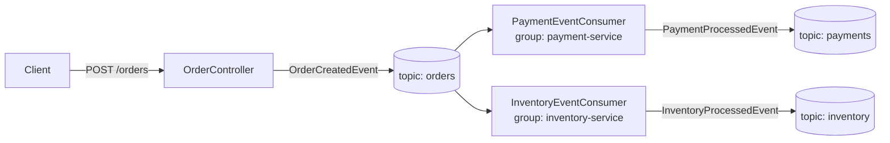

# Event-Driven Architecture with Apache Kafka

**Colombian School of Engineering Julio Garavito — Software Architectures (ARSW)**

Authors: Diego Alejandro Montes · David Felipe Rayo

A small e-commerce lab that shows the **choreography** pattern with Apache Kafka: a single
web request to create an order fans out into independent **payment** and **inventory**
processing, fully decoupled through topics.

---

## What it does



1. `POST /orders` publishes an `OrderCreatedEvent` to the **`orders`** topic (keyed by `orderId`).
2. Two consumer groups read every order in parallel (publish–subscribe):
   - **`payment-service`** decides `APPROVED` / `REJECTED` and publishes to **`payments`**.
   - **`inventory-service`** decides `RESERVED` / `REJECTED` and publishes to **`inventory`**.

Using `orderId` as the partition key guarantees that all events for the same order are
processed in order within a partition.

## Tech stack

- Java 21, Spring Boot 4.1, Spring for Apache Kafka
- Apache Kafka 3.7 in **KRaft** mode (no ZooKeeper), via Docker Compose
- [provectuslabs/kafka-ui](https://github.com/provectus/kafka-ui) for visual inspection
- Maven (wrapper included: `./mvnw`)

## Project structure

```
src/main/java/edu/eci/arsw/kafka/
├── KafkaLabApplication.java          # Spring Boot entry point
├── config/
│   ├── KafkaTopicConfig.java         # Declares topics orders/payments/inventory (3 partitions)
│   └── KafkaProducerConfig.java      # KafkaTemplate<String,Object> + Java 8 time support
├── controller/
│   └── OrderController.java          # POST /orders
├── producer/
│   ├── OrderEventProducer.java       # -> orders
│   ├── PaymentEventProducer.java     # -> payments
│   └── InventoryEventProducer.java   # -> inventory
├── consumer/
│   ├── PaymentEventConsumer.java     # listens orders, group payment-service
│   └── InventoryEventConsumer.java   # listens orders, group inventory-service
└── dto/                              # Event and request payloads
docker-compose.yml                    # Kafka broker + Kafka UI
```

## Topics & business rules

| Topic       | Partitions | Produced by            | Rule |
|-------------|-----------:|------------------------|------|
| `orders`    | 3          | `OrderController`      | — (every request) |
| `payments`  | 3          | `PaymentEventConsumer` | `total <= 250000` → `APPROVED`, else `REJECTED` |
| `inventory` | 3          | `InventoryEventConsumer` | `total <= 300000` → `RESERVED`, else `REJECTED` |

## Prerequisites

- **JDK 21** (the project targets Java 21)
- **Docker** running (for Kafka + Kafka UI)
- Maven — or just use the bundled `./mvnw` wrapper

## How to run

### 1. Start the infrastructure

```bash
docker compose up -d
```

This launches:
- **Kafka broker** on `localhost:9092`
- **Kafka UI** on http://localhost:8080

### 2. Start the application

```bash
./mvnw spring-boot:run
```

On Windows PowerShell: `.\mvnw spring-boot:run`

The app starts on **`localhost:8081`**. On startup it creates the three topics and both
consumer groups begin listening on `orders`.

### 3. Send an order

```bash
curl -X POST http://localhost:8081/orders \
  -H "Content-Type: application/json" \
  -d '{"customerId":"CUS01","total":120000}'
```

Response (`201 Created`):

```json
{ "orderId": "ORD-…", "customerId": "CUS01", "total": 120000,
  "status": "CREATED", "occurredAt": "…" }
```

In the application console you will see both consumers react:

```
Evento procesado en inventory-service para orden: ORD-… -> RESERVED
Evento procesado en payment-service  para orden: ORD-… -> APPROVED
```

Try different totals to see the branches (e.g. `total: 280000` → payment `REJECTED`,
inventory `RESERVED`; `total: 400000` → both `REJECTED`).

### 4. Verify in Kafka UI

Open http://localhost:8080 → cluster **arsw-local**:
- **Topics:** inspect messages in `orders`, `payments`, and `inventory`.
- **Consumers:** the `payment-service` and `inventory-service` groups consuming `orders`.

## Endpoints

| Method | Path      | Body                                | Description |
|--------|-----------|-------------------------------------|-------------|
| `POST` | `/orders` | `{ "customerId": "...", "total": n }` | Creates an order and publishes `OrderCreatedEvent` |

## Configuration notes

- **`spring-boot-starter-kafka`** (not raw `spring-kafka`) is required: in Spring Boot 4 the
  Kafka auto-configuration lives in the `spring-boot-kafka` module that the starter pulls in.
  It provides the `KafkaAdmin` (which creates the declared topics), the consumer factories
  (so `@KafkaListener` works), and the default `KafkaTemplate`.
- **`KafkaProducerConfig`** defines an explicit `KafkaTemplate<String, Object>` (the value type
  the producers use) whose JSON serializer registers `JavaTimeModule`, so `Instant` fields
  serialize as ISO-8601. `jackson-datatype-jsr310` is on the classpath for the same reason.
- **Docker listeners:** the broker advertises two listeners — `PLAINTEXT_HOST://localhost:9092`
  for apps running on the host, and `INTERNAL://kafka:29092` for other containers. Kafka UI
  connects through the internal one (`kafka:29092`); if it used `localhost`, it would resolve
  to its own container and never reach the broker.

## Troubleshooting

- **Kafka UI stuck loading / cluster offline:** make sure the broker advertises the internal
  listener (`INTERNAL://kafka:29092`) and Kafka UI points at `kafka:29092`.
- **`No qualifying bean of type KafkaTemplate<String, Object>`:** the `spring-boot-starter-kafka`
  dependency or `KafkaProducerConfig` is missing.
- **Topics not created on startup:** usually means the Kafka auto-configuration is absent —
  check that the `spring-boot-starter-kafka` dependency is present.
- **Fresh start:** `docker compose down` removes the broker (no volume), so topics are recreated
  on the next app startup.
